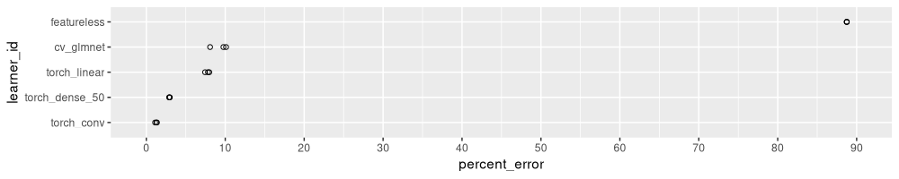

Le but de ce TP est de faire la validation croisée en parallèle (eventuellement sur une grappe de calcul) en python.

Téléchargez [`MNIST_FashionMNIST.csv`](https://rcdata.nau.edu/genomic-ml/cv-same-other-paper/data_Classif/MNIST_FashionMNIST.csv) qui contient deux jeux de données.
Ce sont deux jeux de données de classification d’image, à 10 classes, et à 70 000 lignes chacun.
* sous-échantilloner comme avec TP3 avec [ce code R](MNIST_FashionMNIST_small.R).

Utilisez la validation croisée à 10 divisions (faire la division vous-même, sans utilser sklearn).

Utlilsez les mêmes 3 algorithmes d’apprentissage que dans le TP1.

* [LogisticRegressionCV](https://scikit-learn.org/stable/modules/generated/sklearn.linear_model.LogisticRegressionCV.html)
* `GridSearchCV(cv=3)` avec `KNeighborsClassifier` pour coder les plus proches voisins, avec nombre de voisins entre 1 et 40.
* [DummyClassifier](https://scikit-learn.org/stable/modules/generated/sklearn.dummy.DummyClassifier.html#sklearn.dummy.DummyClassifier) pour donnée un niveau d’erreur de base.

Écrire 4 fichiers python pour la validation croisée en parallèle.

* `combinaisons.py` 
  * définir les algos d’apprentissage dans une dictionnaire, `dict_algos`.
  * dans `if __name__=="__main__"` 
    * préparer les données
	  * lire `MNIST_FashionMNIST_small.csv` 
	  * boucle sur les deux sous-ensembles, MNIST et Fashion.
	  * rajouter une colonne `fold` pour la validation croisée, avec `np.arange()` et `np.tile()`.
	  * écrire `MNIST.csv` et `FashionMNIST.csv`.
    * définir les combinaisons dans un dictionnaire, `comb_dict`, avec clés `données`, `division`, `algorithme`.
    * écrire un fichier `combinaisons.csv` avec une ligne pour chaque combinaison (données, algo, division) que vous voulez calculer en parallèle (`n_tasks` est le nomble de lignes).
	* écrire `combinaisons.sh` dans lequel on a `python calculer_une_combinaison.py $SLURM_ARRAY_TASK_ID`.
	* écrire `calculer_tout.sh` dans lequel on a les commandes python pour GNU parallel. 
* `calculer_une_combinaison.py` 
  * `from combinaisons import dict_algos`
  * `def calculer_une(tâche)` 
    * l’entrée `tâche` est un entier entre 0 et `n_tasks-1`
    * lire la ligne `tâche` dans `combinaisons.csv`.
    * faire l’apprentissage et la prédiction pour la combinaison correspondant.
	* écrire l’erreur sur l’ensemble test dans un fichier `tâche+".csv"` 
  * dans `if __name__=="__main__"` 
    * unpack `sys.argv` pour obtenir la valeur de `SLURM_ARRAY_TASK_ID`, le numéro de tâche.
	* appeler `calculer_une(tâche)`
* `calculer_tout.py` fait les calculs en parallèle avec `multiprocessing`.
* `résultats.py` lit les différents fichiers de résultats (chacun avec une ligne), et écrit un seul fichier `résultats.csv` (avec plusieurs lignes).
* `figure.py` lit le fichier `résultats.csv` et écrit fichiers PNG (sorties graphiques).

Lancer les calculs sur la grappe (SLURM), ou sur votre ordinateur personnel (GNU parallèle ou Python multiprocessing).

Utilisez plotnine pour dessiner les résultats.

* X = taux d’erreur
* Y = algorithme
* un point pour chaque division de validation croisée
* `facet_grid()` un panneau pour chaque jeu de données

Comme ça 

Écrire une réponse à ces questions :

* pour MNIST, quel algorithme donne les meilleures prédictions ?
* pour FashionMNIST, quel algorithme donne les meilleures prédictions ?
* est-ce que les résultats dans python sont cohérénts avec R ?
* Combien de tâches avez-vous calculé en parallèle sur la grappe ?
* Ça a pris combien de temps entre le lancement et la récuperation de résultats ?
* Combien de CPUs avez-vous sur votre ordinateur ?
* Si vous faites les mêmes calculs sur votre ordinateur, combien de temps estimez-vous que ça prend ?
* D’après ces différences en temps de calcul, la grappe est combien de fois plus vite que votre ordinateur ?

Soumettez un fichier PDF avec vos codes, vos réponses, et vos graphiques.

* mettez en gras une section « extra points » si vous tenter les exercises facultatives ci-dessous.
* suivez [les standards dans la rédaction de code python](https://docs.google.com/document/d/1Co1y6bvnNdadnzwAt575JFLkIvGZsQ35ED3QJgMfA3Y/edit?tab=t.0)

## extra points

* +10 si vous dessinez un graphique représentant le temps de calcul de chaque algorithme.
* +10 si vous rajoutez un autre algorithme d’apprentissage (forêt aléatoire, arbre de décision, boosting, et cætera).
* +10 si vous dessinez un graphique avec le taux d’erreur pour chaque nombre de voisins.
* +10 si vous rajoutez `geom_text` avec la moyenne ± écart type, trier Y par moyenne, et un autre `geom_text` avec P d’un T-test pour savoir s’il y a une différence significative entre les algos, comme ça

