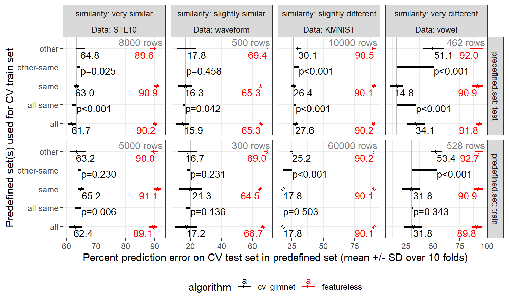

Le but de ce TP est d’explorer la validation croisée pour la généralisation entre sous-ensembles.

# Résumé

Vous allez

* faire la validation croisée,
* eventuellement en parallèle
  * sur une grappe de calcul,
  * ou sur votre ordinateur personnel,
* soit avec python, soit avec R,
* pour démontrer que certaines sous-ensembles sont compatibles pour l’apprentissage, alors que d’autres sous-ensembles ne sont pas compatibles.

# Données et objectif

Téléchargez les deux jeux de données dans [tp6-data](tp6-data).
Chaque fichier répresente un jeux de données avec 600 lignes, dont 300 de sous-ensemble A, et 300 de sous-ensemble B (indiqué dans la première colonne, `subset`).

Ce sont des sous-échantillons des véritables données `waveform` et `vowel`, et
votre but et de refaire l’analyse comme Figure 3 dans [le papier sur SOAK](https://onlinelibrary.wiley.com/doi/10.1002/sam.70055), qui a utilisé la partition pré-défini (train ou test) comme variable de sous-ensemble dans l’algorithme SOAK (Same Other All K-fold cross-validation).
Utiliser un modèle linéaire.
Faire l’apprentissage et la prédiction pour chaque combinaison de :

* jeux de données (vowel ou waveform)
* fold (de 1 à 5)
* sous-ensemble test (subset=A ou B)
* sous-ensemble(s) entraînement (Same=même, Other=autre, All=tout).

# Code

Utiliser soit du code R, soit du code python.

## Code R

Comme dans les TP2 et 3, on peut utiliser mlr3.
Utilser `mlr3resampling::ResamplingSameOtherSizesCV` avec `mlr3::benchmark()` et `mlr3learners::LearnerClassifCVGlmnet`.

## Code Python

Comme dans le TP4, mais `combinaisons.csv` aura une ligne pour chaque combinaison de sous-ensemble test, et sous-ensemble(s) entraînement (en plus que les `données` et `fold`).

* [LogisticRegressionCV](https://scikit-learn.org/stable/modules/generated/sklearn.linear_model.LogisticRegressionCV.html)

# Graphique de résultats

Utilisez plotnine pour dessiner les résultats.

* X = taux d’erreur
* Y = Other en haut, Same au centre, All en bas.
* un point pour chaque division de validation croisée.
* `facet_grid(subset ~ Data)` un panneau pour chaque jeu de données, et sous-ensemble test (A ou B).

Comme ça 

Écrire une réponse à ces questions :

* dans chaque jeu de données, est-ce qu’on gagne en fidelité de prédiction, si on combine les deux sous-ensembles pour l’apprentissage ? (Est-ce qu’All donne meilleures prédictions que Same?)
* dans chaque jeu de données, est-ce qu’on peut entraîner sur un sous-ensemble, et avoir des bonnes prédictions sur l’autre sous-ensemble ? (Est-ce qu’Other donne prédictions aussi bonnes que Same?)
* Est-ce que vos résultats sont cohérents avec le Figure 3 du papier ?
* Quel lettre (A ou B) correpond à la partition pré-défini test (`predefined.set=test`) ?

# PDF à soumettre

Soumettez un fichier PDF avec vos codes, vos réponses, et vos graphiques.

* mettez en gras une section « extra points » si vous tenter les exercises facultatives ci-dessous.
* suivez [les standards dans la rédaction de code python](https://docs.google.com/document/d/1Co1y6bvnNdadnzwAt575JFLkIvGZsQ35ED3QJgMfA3Y/edit?tab=t.0)

# extra points

* +10 si vous faites les calculs dans deux langues (R et python). Lequel semble plus facile pour vous ?
* +10 si vous rajoutez un autre algorithme d’apprentissage (forêt aléatoire, arbre de décision, boosting, et cætera). Est-ce que les résultats ressemblent le modèle linéaire ?
* +10 si vous faites les mêmes analyses avec un autre jeux de données plus grand dans [data_Classif](https://rcdata.nau.edu/genomic-ml/cv-same-other-paper/data_Classif/). Dans chacun, la prèmière colonne est le sous-ensemble, la colonne `y` et la sortie à prédire, et les autres colonnes sont les variables d’entrée.
  * les autres jeux de données de Figure 3,
    * `KMNIST`
    * `STL10`
  * les autres jeux de données d’image que nous avons vu dans les diapos,
    * `MNIST_FashionMNIST`
    * `MNIST_EMNIST`
    * `MNIST_EMNIST_rot`
* +10 si vous rajoutez `geom_text` avec la moyenne ± écart type, et un autre `geom_text` avec P d’un T-test pour savoir s’il y a une différence significative entre les algos.
